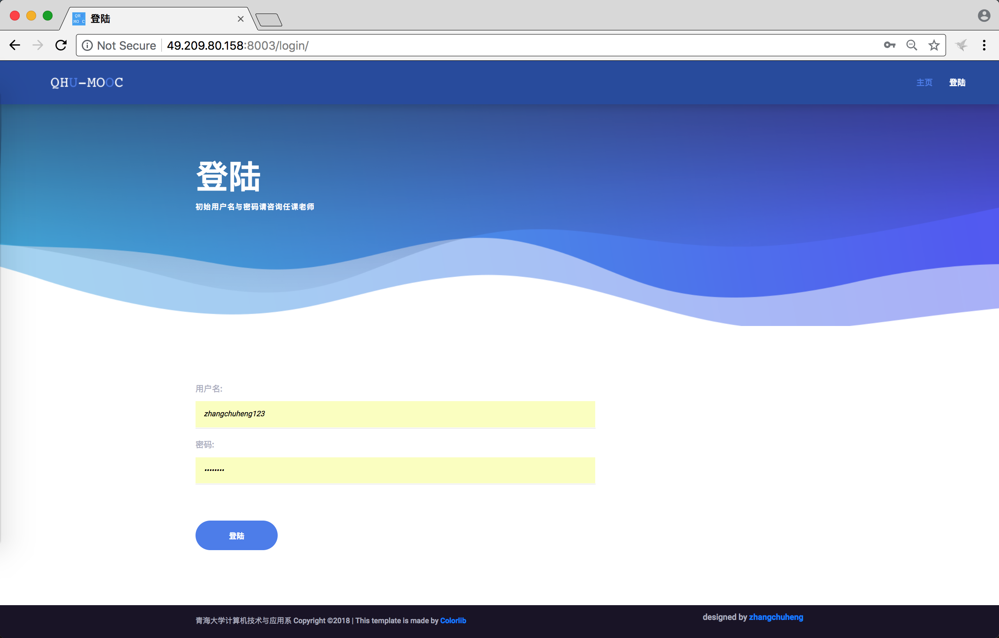
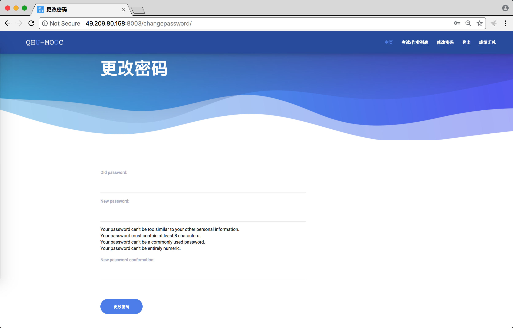
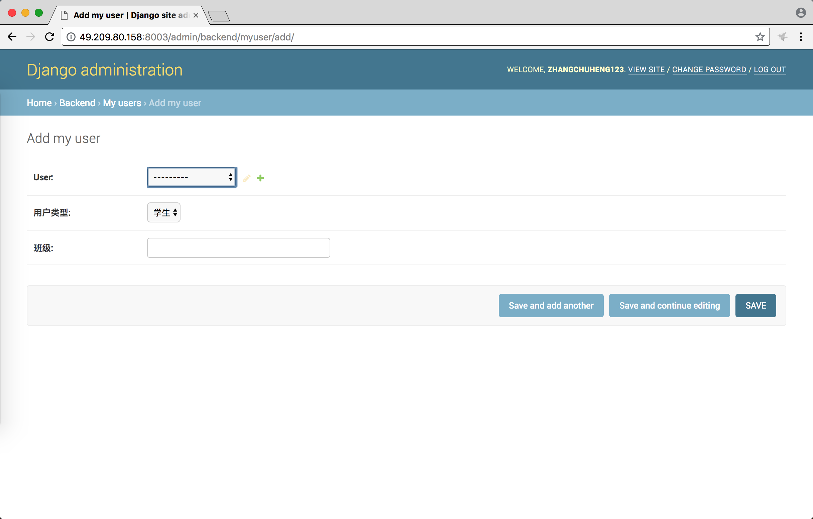
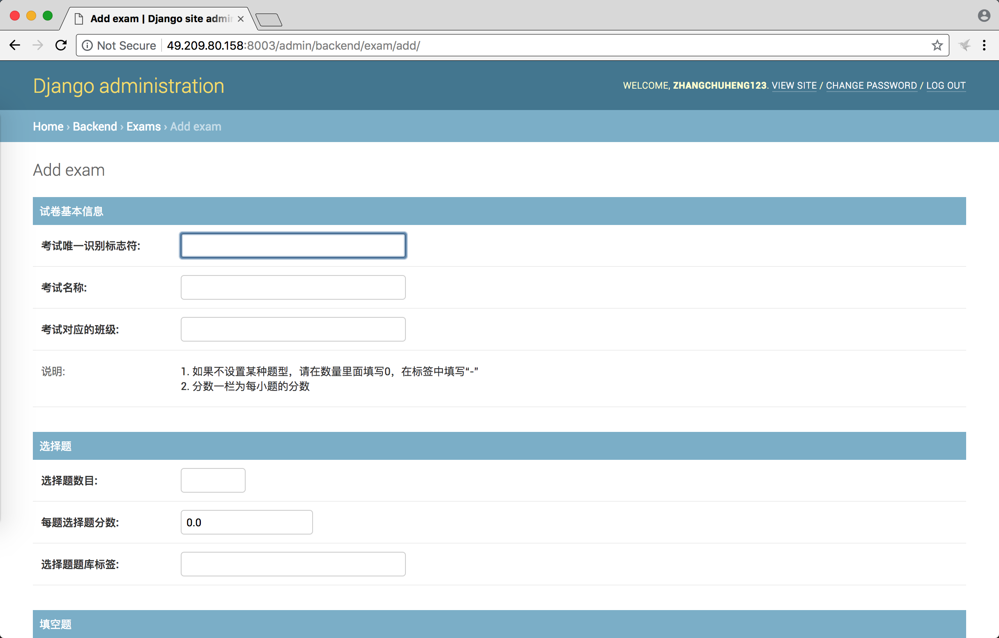
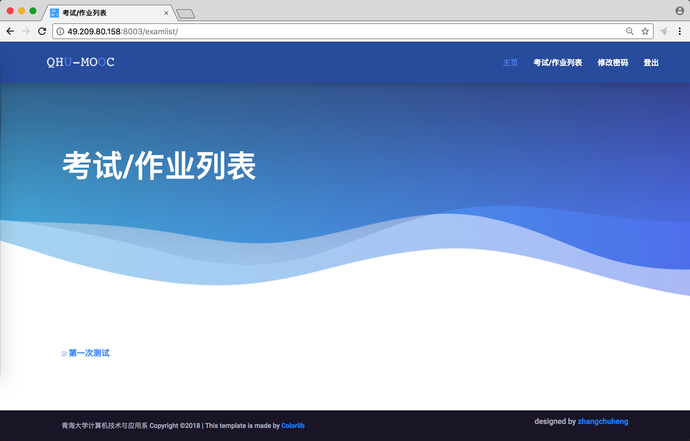
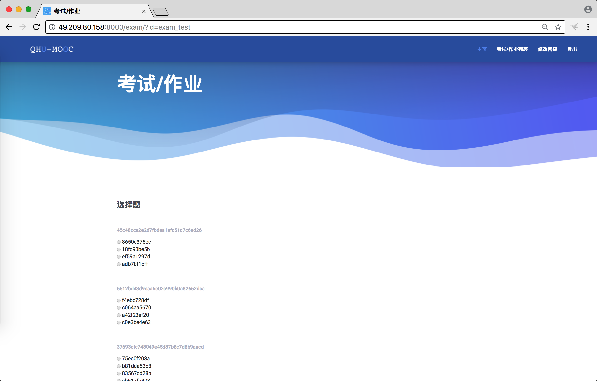
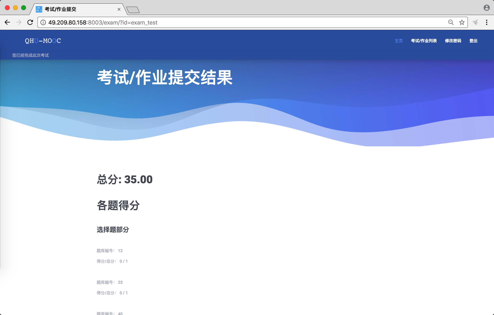
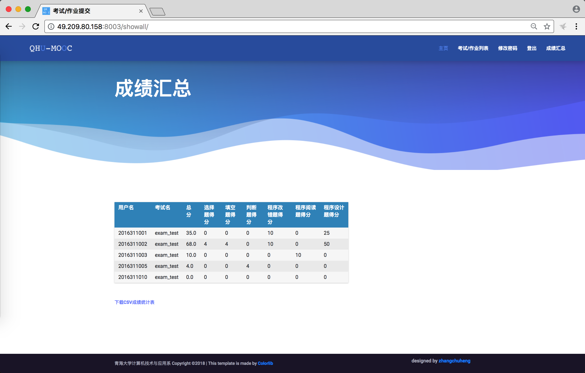
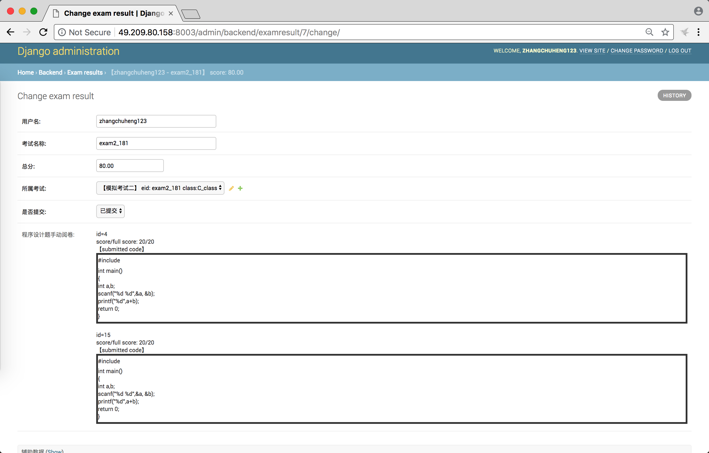
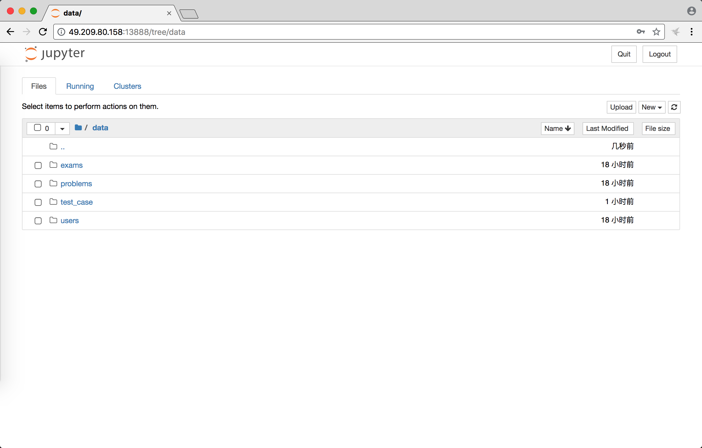

# QHU-MOOC系统操作手册

## 概览

本系统主要设计了四种数据模型，它们分别是：

* 用户(MyUser)：用户管理，包括用户名、密码、分组等；
* 题库(Problem)：一共设计了选择题、填空题、判断题、程序改错题、程序阅读题、程序设计题等六类题型，在该数据模型下可以进行题库管理；
* 考试(Exam)：管理每次考试的组卷；
* 考试结果(ExamResult)：每个考生每次考试的考试结果；

关于这些类型的具体结构参见``backend/models.py``中的定义。

## 安装

```bash
git clone https://github.com/zhangchuheng123/QHU-MOOC.git
```

修改``reset.sh``中的数据库名和数据库密码；修改``reset.sh``中的超级用户的用户名和邮箱。

```bash
bash reset.sh
```

最后会提示输入超级用户的密码，输入两次即安装完成。

网页服务器启动输入

```bash
python manage.py runserver 0.0.0.0:port
```

也可以使用Nginx来启动站点。

## 操作说明

### 登陆

主页登陆之后右上角会有登陆按钮，点击即可登陆。初始密码参见教师添加的初始密码。



### 修改密码

登陆之后会有修改密码的界面，输入旧密码和新密码即可修改。



### 添加单一用户

登陆超级管理员账户 - 页面右上方”管理页面“ - “backend：MyUser” - 右上角的绿色加号；如果要添加教师，请在用户类型选择“教师”，在所属班级填写“teacher”。



### 批量添加用户

登陆超级管理员或者教师账户 - 页面右上方“上传界面” - 下载``data_example\users\add_users.csv``。按照此格式，填写需要新增加的用户名、密码和用户类型。放置``add_users.csv``到``data/users/``目录下，主要字段有``username, password, usertype, classes``，除了``usertype``以外都是任意字符串，``usertype=1``时为学生，``usertype=2``时为教师（管理员权限）。放置在此文件夹下的文件会在第一次访问index页面之后被添加到数据库中，并且将该文件删除，**请做好文件备份**。

### 删除用户

登陆超级管理员账户 - 页面右上方”管理页面“ - “backend：MyUser”，选中需要删除的用户，然后在Action里面选择``Delete selected my users``，然后点击“Go”。

### 添加测试点

登陆超级管理员或者教师账户，页面右上方“上传界面”，在``data/test_case``下新建测试点文件夹，文件夹以不重复的任意字符串命名，放置测试点文件``1.in``、``1.out``等到``data/test_case/<test_case_id>``下，在下一次访问index页面之后，会自动生成相应的该测试点info文件，info文件为判题机的主要判题依据。需要注意的是测试点应该以数字命名，并且从1开始。


### 添加考试

登陆超级管理员账户 - 页面右上方”管理页面“ - “backend：Exams” - 右上角的绿色加号



### 编辑管理题库中的单一题目

登陆超级管理员账户 - 页面右上方”管理页面“ - “backend：Problems” - 选择相应的题目进行编辑

### 批量添加题目至题库

登陆超级管理员或者教师账户，页面右上方“上传界面”，下载``data_example\problems\<problem_type>.csv``，按照相应的格式添加题目，注意题目编号不要和已有题目编号重复。每一行代表题目中的一个题目。然后把编辑好的题库文件放置到``data/problems/``目录下，下次登录index界面刷新的时候就会自动添加到题库中，并且把该文件删除，**请做好文件备份**。注意，该文件表明需要添加到题库中的题目，已存在的不放在此文件中。

### 参加考试（作业）

登陆之后会显示考试列表，点击进入之后即可参加相应的考试；考试做题的过程中请及时点击保存，保存之后的答案在下一次该用户进入该页面的时候会自动显示，没有保存的内容再刷新页面之后会消失，**请及时保存**；点击提交之后即代表完成此次考试（作业），页面会跳转到显示分数的页面，**提交之后不能再次返回写作业**。





### 查看考试分数统计

教师登陆之后有成绩汇总页面，在此页面可以查看成绩并且下载汇总表格。页面列出了已有的所有考试，点击相应的考试可以筛选此考试的成绩信息。




### 程序设计类题目手动阅卷

登陆超级管理员账户 - 页面右上方”管理页面“ - “backend：Exam Results”，在列表中可以点击考试名称进行考试的排序和筛选，然后点击进去进行相应的手动阅卷，手动阅卷直接修改该考生的总分即可。



### 使用Jupyter来上传管理用户、测试点、题库和考试（同样可以用管理员页面来进行管理）

登陆超级管理员或者教师账户 - 页面右上方“上传界面”。



## 修改

### 修改相应的显示模板

文件夹``templates/``下面的各个文件控制各个页面上的显示规则，文件夹``static/``下面控制网站的css/js等样式，它们都可以灵活修改。

### 修改站点逻辑

主要网页逻辑部分在``backend/views.py``文件中，相关数据模型的定义在``backend/models.py``中，管理员界面显示的相关定义在``backend/admin.py``中。